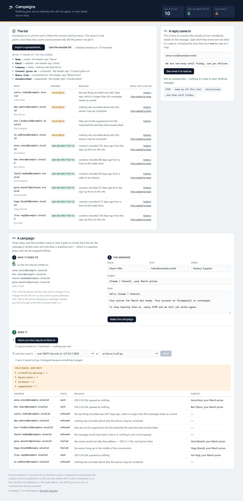
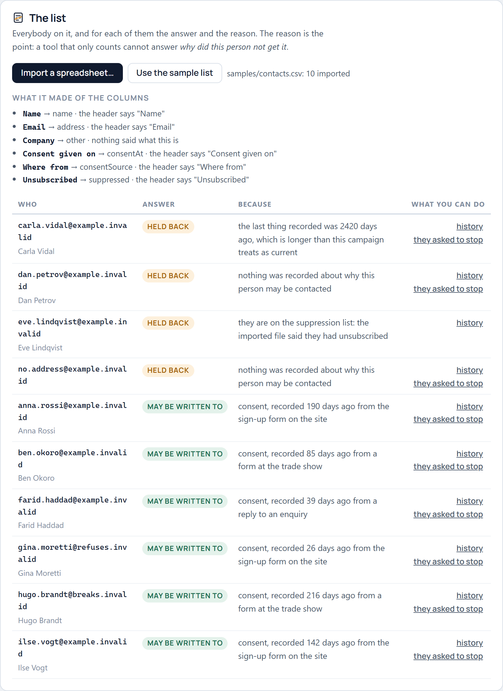
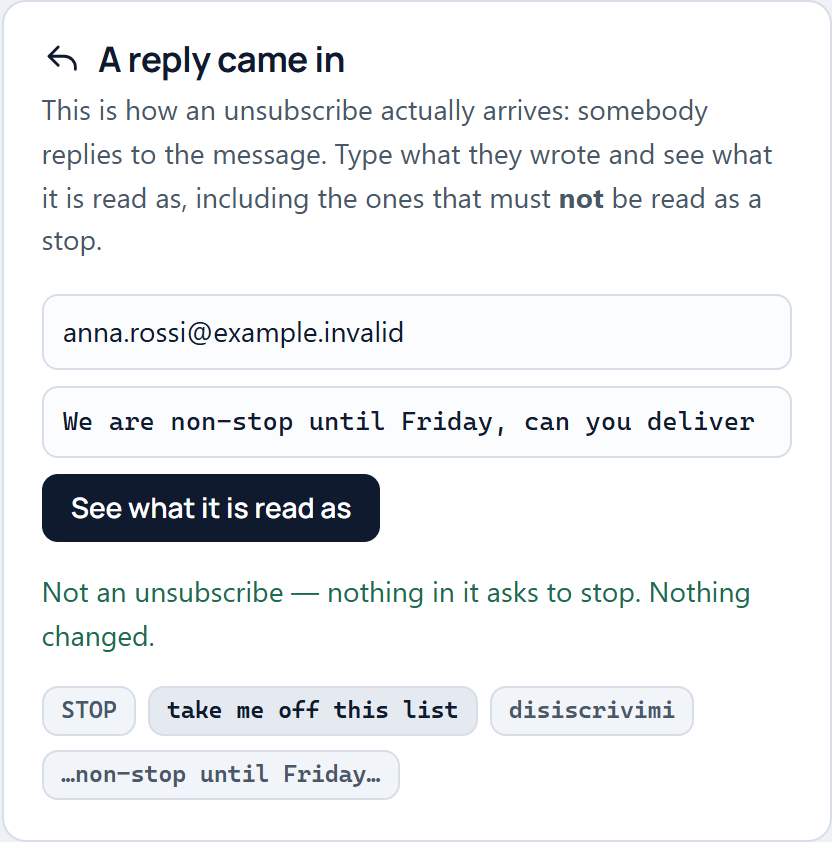
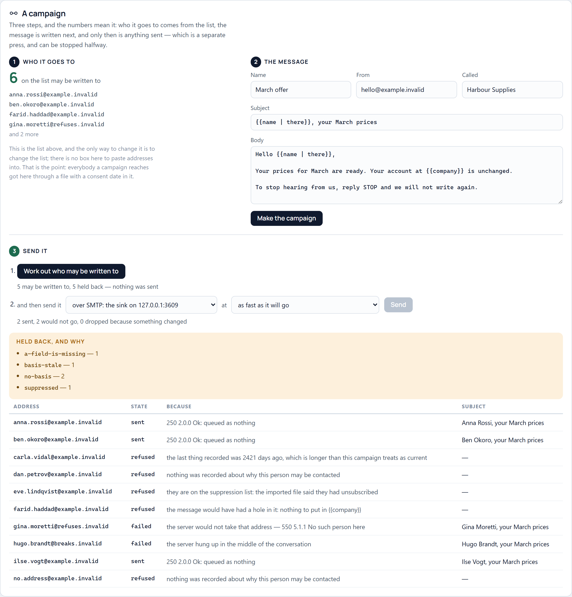
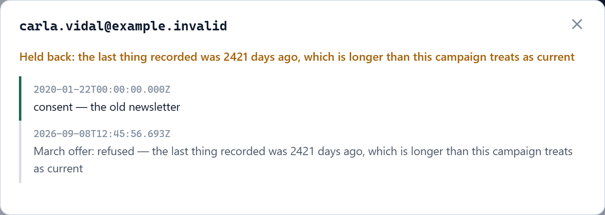
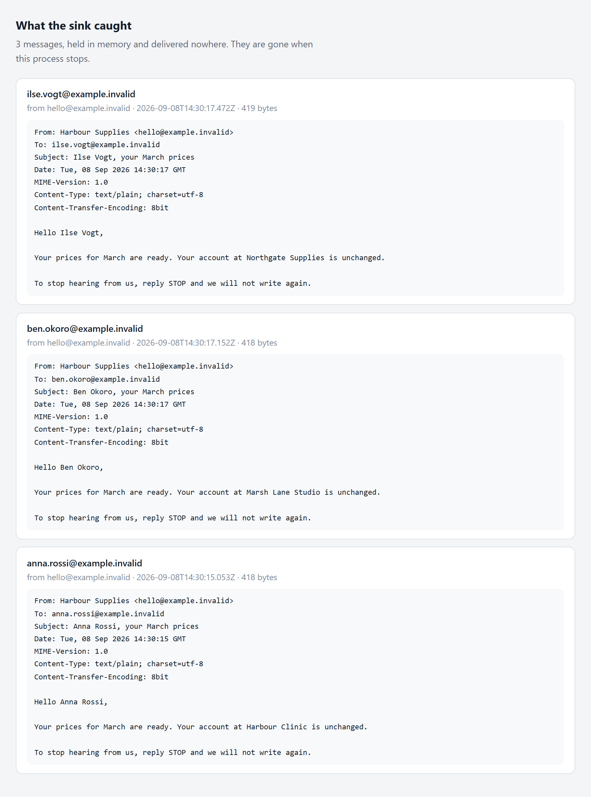

# Campaigns

A tool for sending a personalised message to a list of people, which **cannot
send to anybody who has not agreed to hear from you, or who has asked you to
stop.**

Not "warns you". Not "has a setting for it". The permission check lives inside
the only function in the project that emits anything, it is asked once per
recipient with no batch shortcut, and it is asked *again* immediately before
each send — because a campaign of four hundred at thirty a minute takes a
quarter of an hour, and somebody who unsubscribes in minute two must not be
written to in minute nine.

Every other feature here — importing a spreadsheet, filling in a template,
going at a sensible rate, writing down what happened — is plumbing that a
hundred tools have. What separates a campaign tool from a spam script is that
the second one cannot answer *may I send this*, and this one cannot send
without answering it.



---

## Before you start

**Node 24 or newer**, and nothing else, to run it.

That number is not a guess and it is not "the version I happened to have". The
database is [`node:sqlite`](https://nodejs.org/api/sqlite.html), which is part
of Node rather than a dependency — but only from a certain version. This README
said **22.5** until continuous integration ran the project on 22.5 and it died
inside the module loader: on Node 22 `node:sqlite` exists only behind
`--experimental-sqlite`, which is not the same as existing. A CI job now runs it
on 22.5 on purpose and asserts that what a person sees is a sentence saying
which version is needed, so the number above cannot drift back into a claim.

`npm install` refuses on an older Node rather than installing happily and
failing later — there is nothing npm could install that would fix it.

| to run | you need | why |
| --- | --- | --- |
| the service and the console | Node ≥ 24, npm | `node:sqlite`, unflagged |
| `npm test`, `walkthrough`, `build` | the same | nothing else |
| `npm run check:smtp` | **Docker** | it sends to Mailpit, a mail catcher nobody here wrote |
| `npm run check:screen`, `check:mark`, `screenshots` | **Microsoft Edge** (or any Chromium already installed) | they drive the browser on this machine rather than downloading one |

**Measured, not estimated:** `npm install` fetches 68 packages and writes
**17 MB** into `node_modules`; the repository itself is **2.3 MB** including the
screenshots. `npm run check:smtp` pulls `axllent/mailpit:v1.21` once, which is
**12 MB**. Nothing else touches the network, ever.

**What you do *not* need:** no account, no API key, no mail provider, no
database server, no SMTP relay, no cloud anything. There is no configuration
file to fill in. Every address in this repository ends in `.invalid`, which
[RFC 2606](https://www.rfc-editor.org/rfc/rfc2606) reserves and no mail server
will ever deliver to — a CI step fails the build if one appears that does not.

**To put the machine back:** delete `node_modules/` and `data/` (the whole
database is a file in there), and `docker image rm axllent/mailpit:v1.21` if you
ran the SMTP check. Nothing is installed globally, no ports are left listening,
and no service is registered.

---

## Run it

Two terminals, and nothing else. No account, no provider, no API key, and no
possibility of a test campaign reaching a real person.

```bash
npm install

npm run sink     # an SMTP server that accepts mail and delivers it nowhere
npm start        # the service and the console
```

Then open **http://127.0.0.1:3608** and press **Use the sample list**.

| what | where |
| --- | --- |
| the console and the API | http://127.0.0.1:3608 |
| the sink's SMTP port | 127.0.0.1:3609 |
| what the sink caught | http://127.0.0.1:3610 |

Everything binds to localhost. An SMTP server listening on every interface is
an open relay, and an open relay found by anybody is a spam source with your
address on it.

`npm start -- --sample` fills the database from `samples/contacts.csv` on the
way up, if you would rather not press anything.

---

## The list, and the reason



Ten people go in; six may be written to and four may not, and the page says
which and why for every one of them. The reason is the point — a tool that
answers "412 sent, 88 skipped" cannot answer *why did this person not get it*,
which is the question somebody always asks, usually in front of a customer.

The four refusals in the sample are the four that actually happen:

- **nothing was recorded** about why this person may be contacted
- **the consent is too old** — the last thing on file is from 2020
- **they are on the suppression list** — the imported file said so
- **the message would have had a hole in it** — the template wants a field this
  contact has not got

That last one is not about permission at all. It is about "Hello {{name}}"
arriving at four hundred people, which is the other way a campaign goes wrong.

### What it makes of a spreadsheet

The importer works out what each column is — by the header when the header says
something, by the values when it does not — and **says why it decided**, on the
page, for every column. An importer that silently decides column 4 is the
consent date is an importer nobody can correct.

Two things it does that are worth arguing about:

- A row with an address and no consent **is** imported, as a contact with no
  basis, which the rules then refuse. The contact exists so somebody can go and
  find out where they came from and record it; until they do, nothing can be
  sent. Dropping the row would hide the work. Importing them as sendable is the
  whole failure this project is against.
- `01/03/2026` is read as the first of March. `Date.parse` reads it as the third
  of January, because it assumes the one country that writes the month first —
  and two months of drift is the difference between a consent that is current
  and one that is stale.

---

## Somebody replies "stop"



This is where an unsubscribe actually arrives — not through a form, but as
somebody replying to the message. Reading it automatically is the difference
between honouring the request in seconds and honouring it whenever somebody
next gets round to the inbox.

The decision is silently wrong in **both** directions, so it is made in two
parts and both are tested:

- **Bare keywords** — `stop`, `end`, `quit`, `unsub` — count only when they are
  the whole message. That is how they work on every network that has them, and
  it is what stops *"We are non-stop until Friday, can you deliver then?"* from
  quietly unsubscribing a customer who was telling you about their week.
- **Phrases** — "unsubscribe", "remove me", "take me off", "disiscrivimi" —
  count wherever they appear, because nobody writes those by accident.

The first version matched `\bstop\b` anywhere. It read "non-stop" as an
unsubscribe, and it did not recognise "disiscrivimi" at all.

Whatever it decides, it says which rule matched and on which words. Under-
matching keeps writing to somebody who asked twice; over-matching loses a
customer without anybody noticing. Neither is a thing to leave unexplained.

---

## A campaign, in two steps



**Work it out**, then **send it** — and the first step takes no transport at
all. Not "takes one and does not use it": there is nothing it could send with,
which is the only version of that promise that survives somebody editing the
file. It writes down a decision for everybody, refusals included, with the
reason and the rendered message, so what is approved is what goes.

Only then is a transport chosen, and the default is the one that sends nothing:

| transport | what it does |
| --- | --- |
| `dry-run` | renders every message and sends none of them |
| `file` | writes one `.eml` per message into a folder, for somebody to read |
| `smtp` | speaks SMTP to a real server |

A campaign that has never been looked at should not be able to go out because
somebody pressed the obvious button.

### The rate is not politeness

Anything that receives mail treats a burst from one sender as what it looks
like, and the punishment lands on the whole domain's reputation rather than on
the one campaign. So the gap is measured from the **start** of one send to the
start of the next — measuring from the end lets a fast transport go as fast as
it likes, which is exactly the case that gets a domain blocked.

### Everything about one person



Every basis ever recorded, the suppression, and every message ever decided
about them — for when they write in and ask. A consent is a **row**, not a
column: agreeing, changing your mind and agreeing again leaves three rows, and
the current answer is the newest of them. A boolean would leave one, and it
would be a boolean nobody could defend.

A suppression is keyed on the **address**, not on a contact. Deleting somebody
who unsubscribed feels tidy and is the bug: they are re-imported next month
from the same spreadsheet, arrive with no history, and are written to again.

---

## What it is checked with

Five layers, and each one has caught something the others could not.

```bash
npm test              #  86  the rules, the importer, the template, the store
npm run walkthrough   #  35  the whole story through HTTP, against a live service
npm run check:screen  #  24  the console, driven with a browser
npm run check:smtp    #  13  against an SMTP server nobody here wrote
npm run check:mark    #  11  the icon, at the size it is actually seen
npm run build         #       nothing to compile, so it starts it
```

**`npm test`** is the rules on their own, with the clock injected into every one
of them so they say the same thing in two years as they do today.

**`npm run walkthrough`** starts the service and the sink on their own ports
with a throwaway database and tells the story once. `mayReceive` being right is
one thing; a service that never calls it, or has a route that goes around it,
is another, and only a real request finds that out.

**`npm run check:screen`** drives the console with the browser already on this
machine. It counts rather than samples — a page that draws the first three rows
and stops looks exactly like a page that works — and it asserts that the reason
somebody was held back is *on the page*, which is the whole claim. It found a
`POST` that was going out as a `GET` because the method was inferred from
whether there was a body.

**`npm run check:smtp`** sends to [Mailpit](https://github.com/axllent/mailpit)
in a container and reads the messages back out of *its* API. The sink and the
client here were written by the same person on the same afternoon, and anything
they both get wrong they will agree about. It needs Docker; without it, it says
so and fails rather than printing "0 problems", because a check that passes by
not running is worse than no check.

**`npm run check:mark`** renders the icon at 16 pixels and measures it. The
first mark was three lines with the middle one struck out; at tab size the
lines were a pixel and a half each and dissolved into a grey block, so it was
redrawn as two.


Nothing in `npm run screenshots` photographs the screen — it starts its own
service, opens the console in a browser and captures **the page**. A screenshot
of the screen is a screenshot of everything that was on it.

---

## What it deliberately does not do

The tool this was rebuilt from sent its messages by **driving somebody's web
messaging client with a browser** — loading the site, restoring a saved
session, opening a chat by phone number, typing, pressing send. That is not
rebuilt here, and not because it would have been hard.

The small reason: it is against the terms of every messaging platform that has
them.

The large one: a tool that takes a pasted list of phone numbers and sends them
all a message is a spam machine pointed at people who never asked, whatever the
intention of whoever runs it. The rest of this project exists to make that
impossible. Shipping that transport would put it back.

So a transport is an interface, and the three above are the ones that can be
shipped honestly. Anything else — a provider's API, a real mail relay — is
twenty lines against a documented service by somebody who has an account with
it, which is a different act from finding it already written.

**This is not legal advice and it does not make a campaign lawful.** It
enforces four things that are necessary and are routinely skipped. Whether a
particular basis is valid for a particular message in a particular country is a
question for somebody else. What it can do is make it impossible to send
without having recorded an answer.

---

## How it is put together

```
src/rules/permission.js   the whole argument: may this person be sent this
src/import/csv.js         a spreadsheet, and what each column probably is
src/render/template.js    filling one in, and refusing to guess
src/store/db.js           SQLite: contacts, bases, suppressions, messages
src/send/campaign.js      the only thing here that sends anything
src/send/transports.js    dry run, a folder, and SMTP spoken by hand
src/http/api.js           the service and the console it serves
sink/smtp.js              a real SMTP server that delivers nowhere
```

One dependency — [express](https://expressjs.com) — and Node's own
[`node:sqlite`](https://nodejs.org/api/sqlite.html), so the database needs
nothing installed. SMTP is written out rather than pulled in, because the
conversation is the part that goes wrong: multi-line replies, dot-stuffing,
`RCPT TO` refused while `MAIL FROM` was accepted, a server that hangs up
mid-message. A service whose sending is a black box is a service nobody can
debug when a server starts refusing things at four in the afternoon.

Requires **Node 24 or newer**, for `node:sqlite` — see [Before you start](#before-you-start).



---

## Licence

MIT — see [LICENSE](LICENSE).

---

Developed by **Riccardo Sapuppo**.
